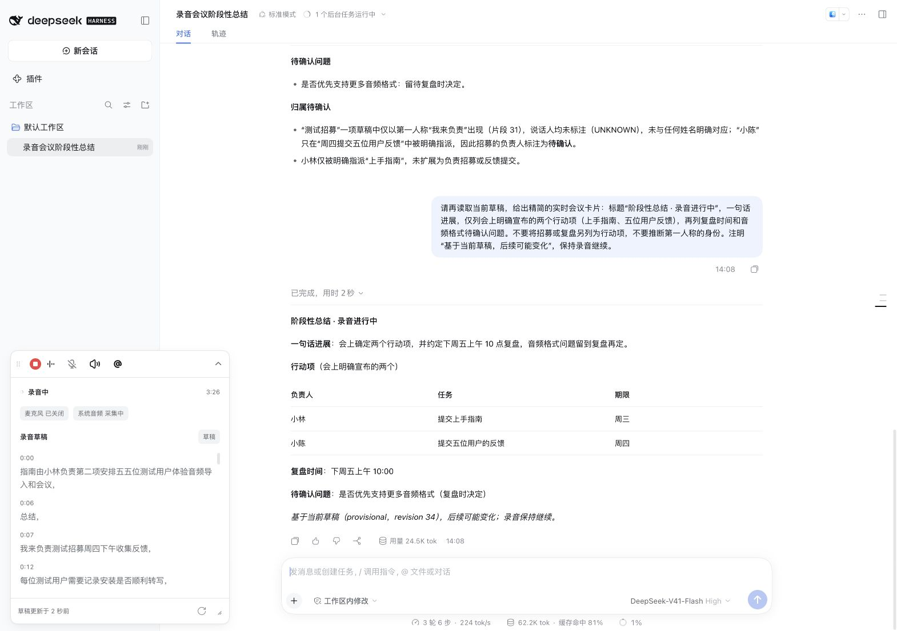
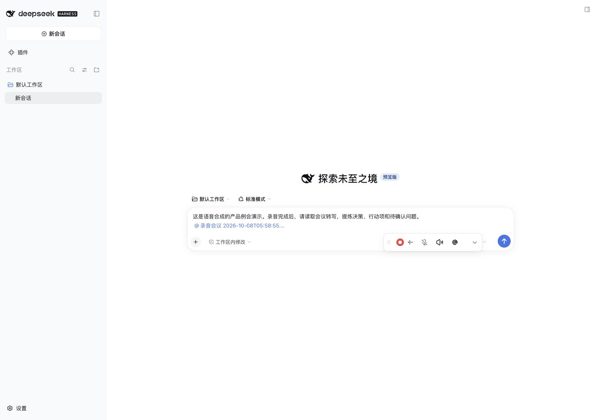
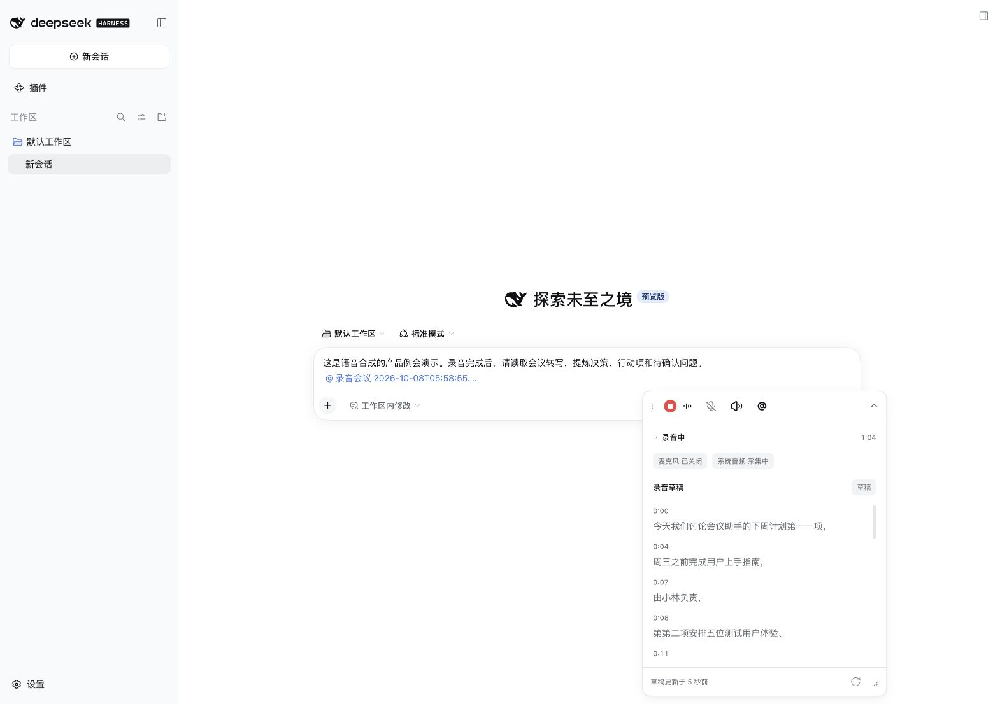
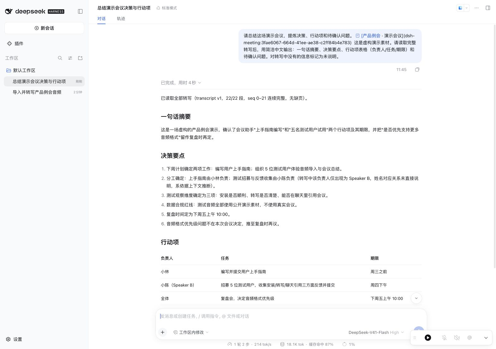

# dsh-asr-plugin

English | [简体中文](README.zh-CN.md)

[Project site](https://huliux.github.io/dsh-asr-plugin/) ·
[Getting started](https://huliux.github.io/dsh-asr-plugin/start.html)

[](https://www.npmjs.com/package/@huliux/dsh-asr-plugin)
[](LICENSE)

Unofficial local meeting transcription plugin for DeepSeek Harness (DSH) on Apple Silicon macOS.
The plugin imports WAV, M4A and MP3 files, records microphone and system audio,
and produces transcripts with timestamps and speaker labels. Meetings can be
referenced explicitly in DSH messages for reading and export.



This example uses a fictional, speech-synthesized meeting. While recording
continues, an `@` reference lets the configured DeepSeek model read the live draft
and generate an interim summary. The summary is a user-requested snapshot and can
change as the draft evolves. See the [workflow screenshots](assets/screenshots/README.md)
for the full example and environment details.
[Official community showcase](https://github.com/deepseek-ai/deepseek-harness/discussions/9125).

## Compatibility

| Component | Requirement |
| --- | --- |
| Host | DSH 0.2.0-rc.2 |
| Runtime | Node.js 24 |
| Platform | macOS, Apple Silicon (`darwin` / `arm64`) |
| Microphone API | macOS 13.5 or later |
| System audio and dual-track APIs | macOS 14.2 or later |

These macOS versions specify API availability; they are not a tested OS matrix.
DSH desktop and Web modes both process audio on the Mac running DSH.
Windows, Linux and Intel Macs are unsupported.

## Installation

Install `@huliux/dsh-asr-plugin` from the DSH Plugins page. Web profiles also
support the CLI:

```sh
dsh plugin --profile web add --ignore-scripts @huliux/dsh-asr-plugin@0.1.2
```

The package includes native add-ons and an ad-hoc signed recording Helper.
The Helper is not notarized; macOS may require permission or security approval
at installation and after updates. Keep system security protections enabled.

Desktop and Web profiles share the default meeting store. Run one plugin host
per data directory. Preserve meeting and model data when replacing a package.

For package verification, local archive installation and release channels, see
[distribution](docs/distribution.md). Source downloads require the complete
[source build](docs/development.md) before recording. Report installation problems
through [GitHub Issues](https://github.com/huliux/dsh-asr-plugin/issues), including
the plugin, DSH, Node.js and macOS versions without meeting data or credentials.

## Model preparation

In plugin settings, download the base models (approximately 278 MiB).
Optional punctuation models require approximately 274 MiB and apply automatically
to new recordings, imports and retranscriptions after verified installation.
Existing tasks and transcripts retain their processing mode. A damaged installed
punctuation pack must be repaired before starting new tasks.

Models are downloaded from pinned upstream revisions and verified by size and
SHA-256 before installation. Weights are excluded from Git, npm and GitHub Releases.
Enabling the plugin does not initiate a model download. Downloads support
cancellation and retry; complete verified files can be reused after failure.
See [model assets](docs/model-assets.md) for sources, proxy behavior and offline staging.

## Recording and meeting access

Use **Recording permissions** in plugin settings to check microphone and system
audio access. Each recording start performs fresh admission checks.
A failed system-audio check may reflect permission, output volume or device
routing. Silence during a recording does not establish a permission denial.

Expanding the recorder prepares models without capturing audio. Sequential
recordings can reuse loaded model resources, which are released after five idle
minutes. Audio, drafts and speaker state remain separate for each meeting.

Select a DSH session to record, or ask the DSH agent to import an absolute local
audio path. Use the `@` picker to reference a meeting and request reading or export.
File writes use DSH Approval. Meetings persist independently of DSH sessions and
workspaces.

The compact recorder shows the active capture controls:



Expand it to view elapsed time, track states and the live transcript draft:



For imported audio or after recording, reference a meeting to summarize its
committed transcript:



Audio inference runs locally after model preparation. Reading a transcript with
an LLM can send its content to the provider configured in DSH; host configuration
and provider terms govern that operation.

## Limitations

- Speaker labels distinguish voices within a meeting; they do not establish
  personal identity. Recognition and speaker accuracy depend on input conditions;
  no general accuracy benchmark is reported.
- Three fixed model weights currently have one verified provider. A provider
  outage can prevent installation; same-named weights cannot be substituted.
- Sent message history can show an internal meeting-reference link even when
  the picker and composer display the meeting title.

## Development and licensing

See [development](docs/development.md) for source builds and verification,
[CONTRIBUTING.md](CONTRIBUTING.md) for contributions, and
[publishing](docs/publishing.md) for package preparation.

Project-owned source is licensed under [Apache-2.0](LICENSE). Third-party source
and models retain their respective terms; see
[THIRD_PARTY_NOTICES.md](THIRD_PARTY_NOTICES.md) and the notices in `third_party/`
and vendored native directories.

## Support and contact

- Usage questions, bug reports and feature requests:
  [GitHub Issues](https://github.com/huliux/dsh-asr-plugin/issues).
  See [support guidelines](SUPPORT.md) for useful diagnostic information.
- Collaboration and private inquiries:
  [dasenrising@gmail.com](mailto:dasenrising@gmail.com).
- Security vulnerabilities: follow [the security policy](SECURITY.md) to report
  privately.
