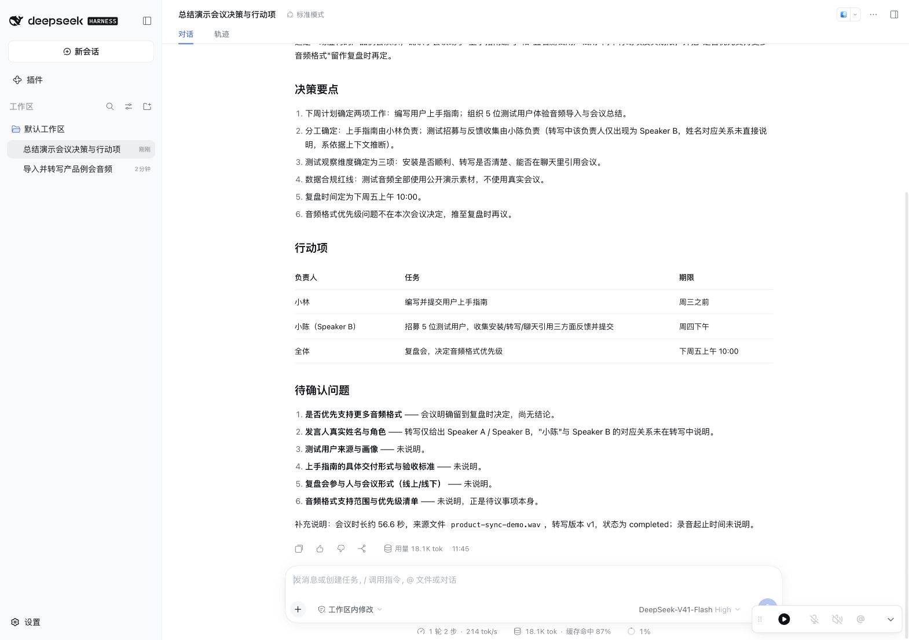
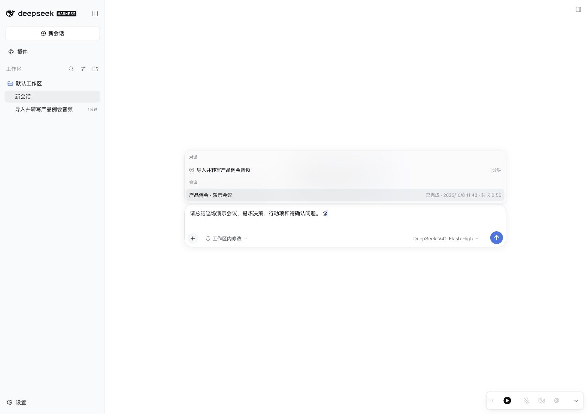
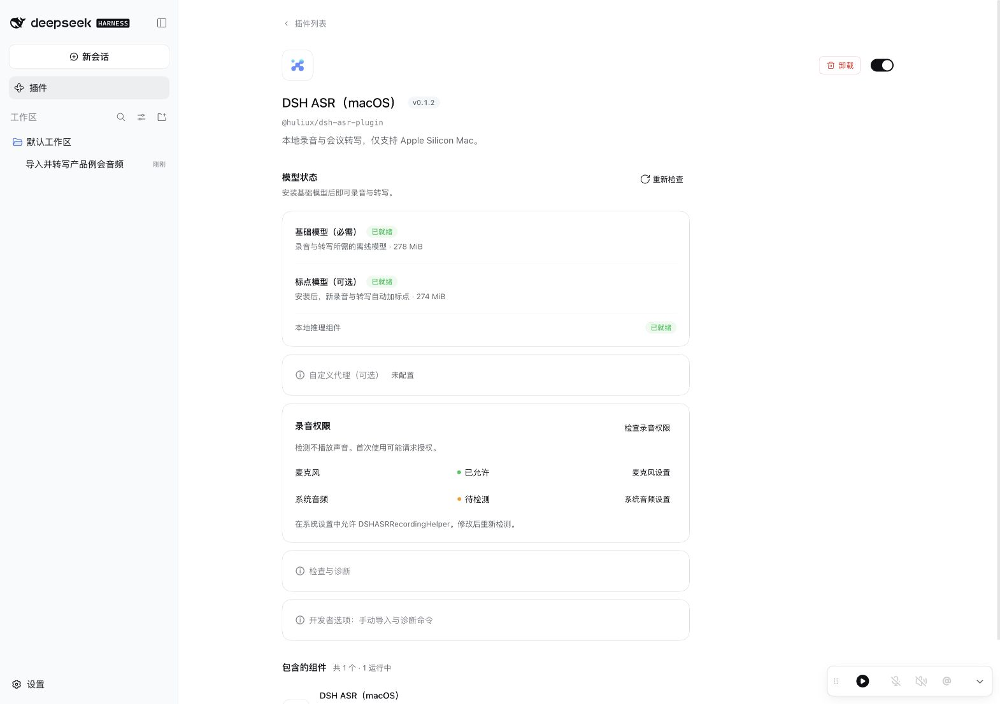

# Meeting workflow screenshots

These unedited DSH Web screenshots show the published plugin 0.1.2 on DSH
0.2.0-rc.2, Node.js 24.18.0 and Apple Silicon macOS 26.7, captured on 2026-10-08.

The example is a fictional product meeting generated with macOS speech synthesis.
The 56.6-second WAV was imported and transcribed by the plugin, producing 22
segments and two speaker labels. A separate DSH conversation selected the meeting
with `@`, read the complete transcript and used a configured DeepSeek model to
summarize decisions, action items and open questions. No real meeting data is shown.

The summary screenshots demonstrate audio import and meeting references. The
additional recording screenshots show an actual recording session capturing the
same fictional audio played through the Mac system output. At capture time, the
microphone is off and system audio is active; the expanded recorder displays
provisional text and elapsed time. In `recording-active.jpg` and
`recording-expanded.jpg`, the prompt in the composer is an unsent request.

The live-summary screenshot shows a later, separate recording session. A meeting
was selected with `@` while capture continued; the configured DeepSeek model
actually called `meeting_live_get` and generated an interim summary from draft
revision 34. This is a user-requested snapshot, not an automatically refreshing
summary. The recorder remains active in the image, and the response labels its
content as provisional and subject to change.
These examples are not an accuracy benchmark or a complete recording-permission
test matrix. Audio inference runs locally;
the referenced transcript is sent to the LLM provider configured in DSH for summary.

## Active recording / 正在录音

## Expanded recorder / 录音组件展开

## Summarize during recording / 边录边总结

## Meeting summary / 会议总结

## Action items / 行动项

## Meeting reference / 会议引用

## Model preparation / 模型准备

